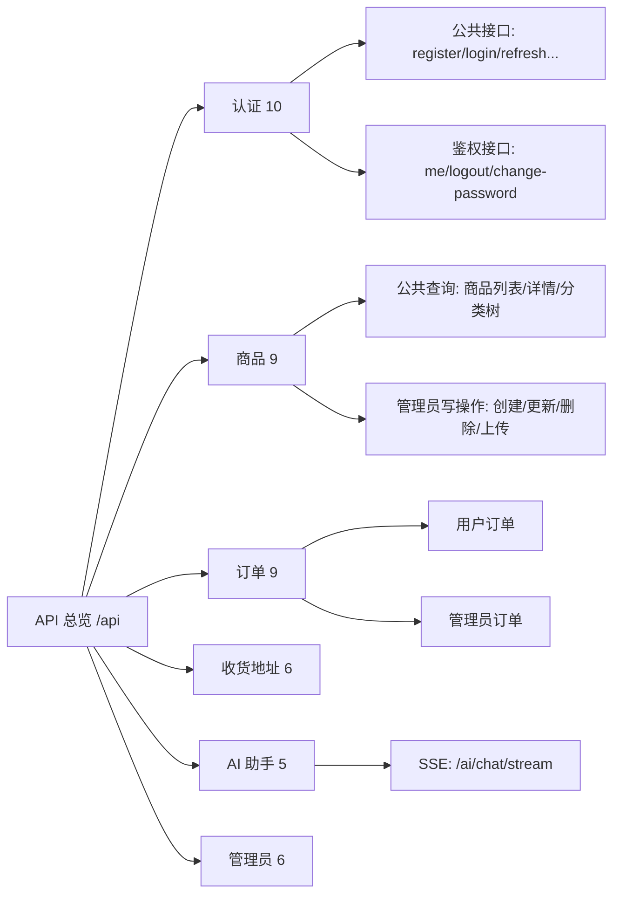
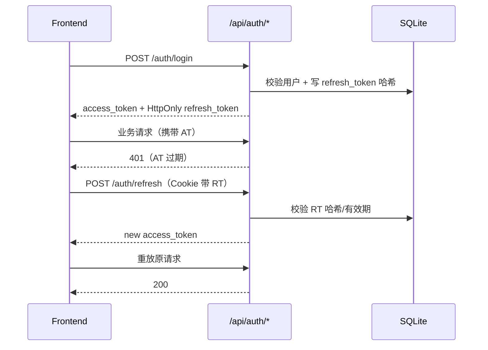
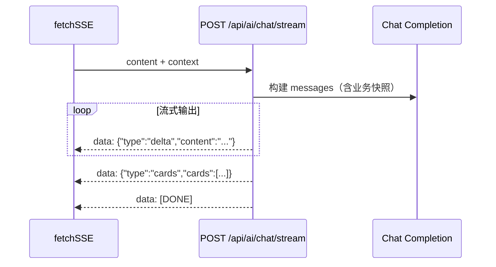

# 可视化接口文档

更新时间：2026-03-25  
数据来源：`backend/app/main.py` + 各 Router + FastAPI OpenAPI 自动导出

## 1. 文档入口

- Swagger UI（可视化调试）：`/docs`
- ReDoc（阅读模式）：`/redoc`
- 健康检查：`GET /health`

> 当前后端共有 `45` 条 `/api` 路由，折合 `37` 个 OpenAPI Path。

## 2. 接口全景图



## 3. 权限矩阵

| 标记 | 说明 |
|---|---|
| `Public` | 无需登录 |
| `Bearer(User)` | 任意已登录用户 |
| `Bearer(Admin)` | 仅管理员 |

## 4. 接口清单（按业务域）

### 4.1 认证（10）

| Method | Path | 权限 | 说明 |
|---|---|---|---|
| POST | `/api/auth/register` | Public | 注册 |
| POST | `/api/auth/login` | Public | 登录，返回 AT + 写入 RT Cookie |
| POST | `/api/auth/refresh` | Public | 用 RT 刷新 Access Token |
| POST | `/api/auth/forgot-password` | Public | 忘记密码重置（用户名+邮箱） |
| POST | `/api/auth/recovery-request` | Public | 封禁账号恢复申请 |
| GET | `/api/auth/me` | Bearer(User) | 获取当前用户 |
| PUT | `/api/auth/me` | Bearer(User) | 修改用户名/邮箱 |
| POST | `/api/auth/change-password` | Bearer(User) | 修改密码并强制全端失效 |
| POST | `/api/auth/logout` | Bearer(User) | 单设备退出（AT 拉黑 + RT 删除） |
| POST | `/api/auth/logout-all` | Bearer(User) | 全设备退出（token_version++） |

### 4.2 商品（9）

| Method | Path | 权限 | 说明 |
|---|---|---|---|
| GET | `/api/products` | Public | 商品列表（分页、分类、状态、关键词） |
| GET | `/api/products/{product_id}` | Public | 商品详情 |
| GET | `/api/products/categories` | Public | 分类树/层级筛选 |
| POST | `/api/products/categories` | Bearer(Admin) | 创建分类（自动生成分类编码） |
| POST | `/api/products` | Bearer(Admin) | 创建商品（自动触发向量任务） |
| PUT | `/api/products/{product_id}` | Bearer(Admin) | 更新商品 |
| DELETE | `/api/products/{product_id}` | Bearer(Admin) | 删除商品 |
| POST | `/api/products/upload-image` | Bearer(Admin) | 上传商品图（<=5MB） |
| POST | `/api/products/{product_id}/embedding/sync` | Bearer(Admin) | 手动重试向量化 |

### 4.3 订单（9）

| Method | Path | 权限 | 说明 |
|---|---|---|---|
| POST | `/api/orders` | Bearer(User) | 创建订单（库存原子扣减） |
| GET | `/api/orders` | Bearer(User) | 我的订单列表（分页/筛选） |
| GET | `/api/orders/{order_id}` | Bearer(User) | 我的订单详情 |
| POST | `/api/orders/{order_id}/pay` | Bearer(User) | 模拟支付 |
| POST | `/api/orders/{order_id}/confirm-receipt` | Bearer(User) | 确认收货 |
| POST | `/api/orders/{order_id}/cancel` | Bearer(User) | 取消订单并回滚库存 |
| GET | `/api/orders/admin/all` | Bearer(Admin) | 管理员查看全部订单 |
| GET | `/api/orders/admin/{order_id}` | Bearer(Admin) | 管理员查看订单详情 |
| PUT | `/api/orders/admin/{order_id}/status` | Bearer(Admin) | 管理员改状态 |

### 4.4 收货地址（6）

| Method | Path | 权限 | 说明 |
|---|---|---|---|
| POST | `/api/addresses` | Bearer(User) | 新建地址（最多5条） |
| GET | `/api/addresses` | Bearer(User) | 地址列表 |
| GET | `/api/addresses/{address_id}` | Bearer(User) | 地址详情 |
| PUT | `/api/addresses/{address_id}` | Bearer(User) | 更新地址 |
| DELETE | `/api/addresses/{address_id}` | Bearer(User) | 删除地址 |
| POST | `/api/addresses/{address_id}/set-default` | Bearer(User) | 设置默认地址 |

### 4.5 AI 助手（5）

| Method | Path | 权限 | 说明 |
|---|---|---|---|
| POST | `/api/ai/chat/stream` | Bearer(User) | SSE 流式对话 |
| POST | `/api/ai/chat` | Bearer(User) | 非流式对话 |
| GET | `/api/ai/history` | Bearer(User) | 历史消息 |
| DELETE | `/api/ai/history` | Bearer(User) | 清空历史 |
| POST | `/api/ai/products/{product_id}/sync-embedding` | Bearer(User) | 商品向量同步（调试用途） |

### 4.6 管理员（6）

| Method | Path | 权限 | 说明 |
|---|---|---|---|
| GET | `/api/admin/dashboard/stats` | Bearer(Admin) | 看板统计 |
| GET | `/api/admin/users` | Bearer(Admin) | 用户列表 |
| PATCH | `/api/admin/users/{user_id}/status` | Bearer(Admin) | 封禁/解封 |
| POST | `/api/admin/users/{user_id}/reset-password` | Bearer(Admin) | 重置密码 |
| GET | `/api/admin/recovery-requests` | Bearer(Admin) | 恢复申请列表 |
| PUT | `/api/admin/recovery-requests/{request_id}/process` | Bearer(Admin) | 处理恢复申请 |

## 5. 关键时序图

### 5.1 登录 + 无感刷新



### 5.2 AI SSE 流式协议



## 6. 核心数据快照约束（接口视角）

- 下单接口 `POST /api/orders`：写入 `orders.receiver_info`（地址 JSON 快照）。
- 下单接口 `POST /api/orders`：写入 `order_items.buy_price`（价格快照）。
- 鉴权接口组：通过 `refresh_tokens + access_token_blocklist + token_version` 联动清退。

## 7. 联调示例

### 7.1 Axios 下单

```ts
import { post } from '@/utils/request';

const created = await post('/orders', {
  address_id: 12,
  items: [
    { product_id: 101, quantity: 2 },
    { product_id: 205, quantity: 1 },
  ],
});
```

### 7.2 SSE 对话

```ts
import { fetchSSE } from '@/utils/request';

await fetchSSE({
  url: '/ai/chat/stream',
  body: { content: '帮我推荐三款适合通勤的轻薄本', context: { page_type: 'home', page_path: '/' } },
  onMessage: data => console.log('chunk', data),
  onDone: () => console.log('done'),
  onError: err => console.error(err),
});
```

