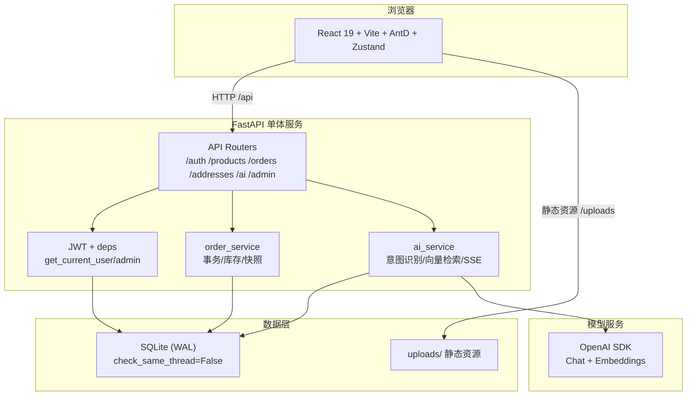
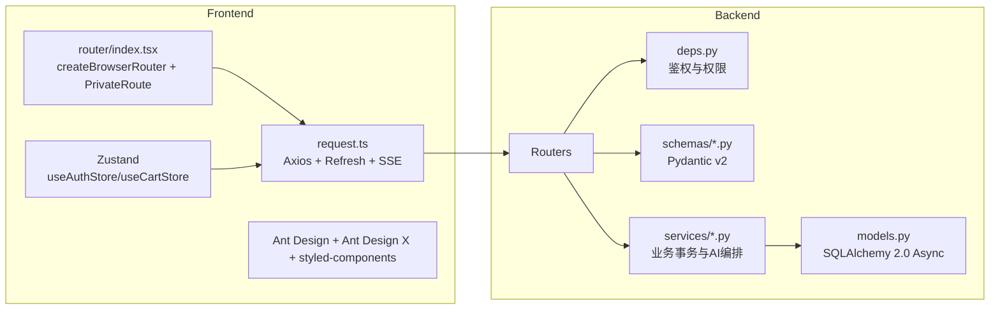
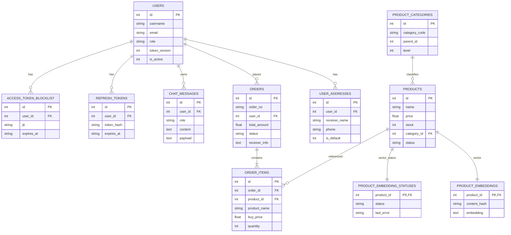
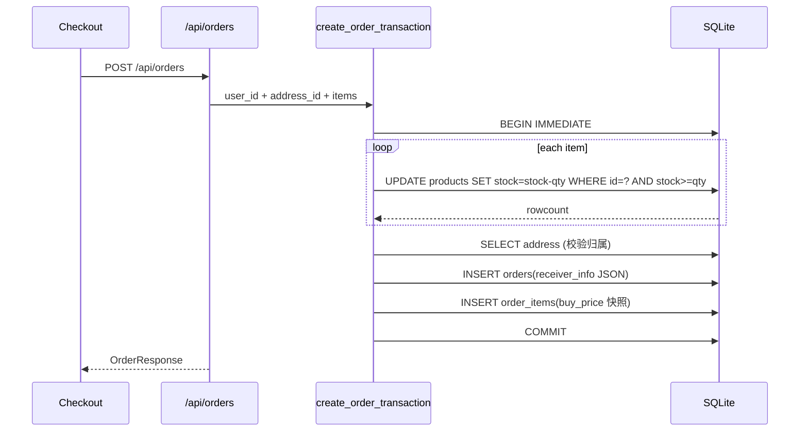
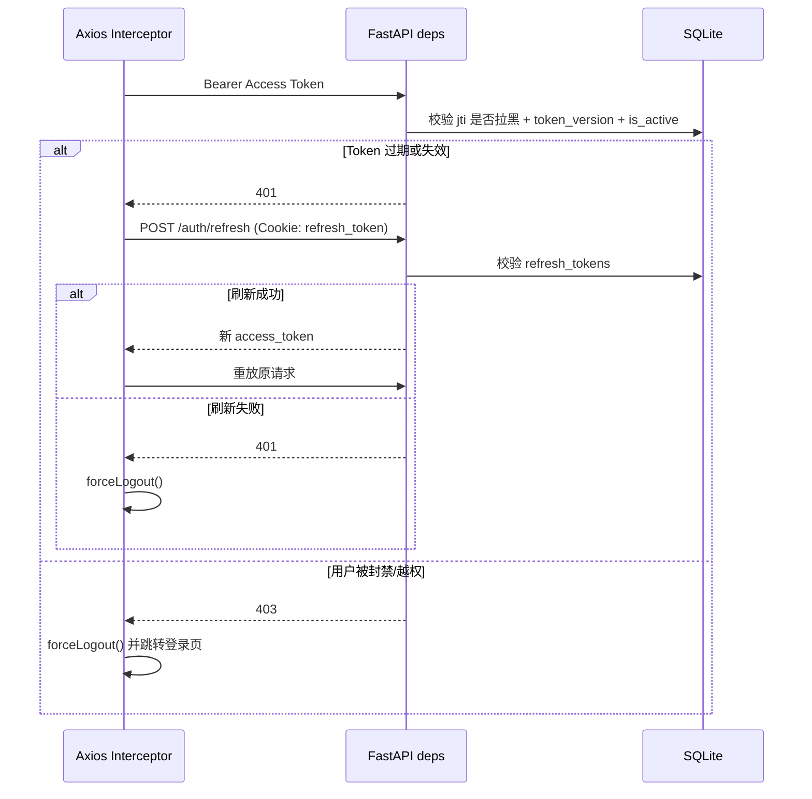
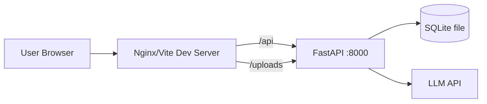

# 架构可视化文档

更新时间：2026-03-25

## 1. 架构目标

- 单体轻量：单后端服务 + 单 SQLite，拒绝过度拆分。
- 前后端清晰分层：React 端负责交互，FastAPI 负责鉴权与业务编排。
- AI 路由与业务计算分离：模型只做表达，业务数据由后端先计算后注入。

## 2. 系统上下文图

## 3. 前后端分层图

## 4. 数据模型 ER 图（核心表）

## 5. 关键业务时序图

### 5.1 下单事务（防超卖 + 快照固化）

### 5.2 鉴权联锁清退（401/403）

## 6. 部署视图（本地/单机）

## 7. 架构结论

- 已满足“轻量化单体 + SQLite + 事务一致性 + SSE AI 接口”的核心要求。
- 订单快照、防踢出、安全鉴权均已落地在真实代码路径中。
- 当前最需要加强的是测试覆盖与 AI 服务模块复杂度治理（见《技术方案评审报告》）。

